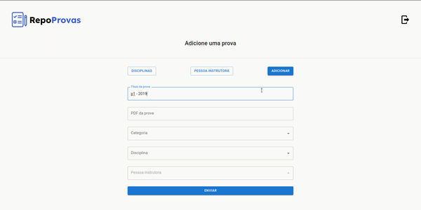

<h1 align="center">
   📑 <a href="#"> RepoProvas </a>
</h1>

<h3 align="center">
    Compartilhe provas facilmente!
</h3>


## Sobre

O RepoProvas é um projeto que permite o usuário acessar e adicionar provas antigas, filtrando por disciplina, professor e período.

---


## Layout

<div align="center">
 
</div>

---

## Como funciona

Este projeto está dividido em duas partes:
1. Backend (que você pode acessar aqui: https://github.com/fernando-yaeda/repo-provas-api-2)
2. Frontend (este repositório)

---

## Pré-requisitos

Antes de começar você deve ter instalado:
[Git](https://git-scm.com), [Node.js](https://nodejs.org/en/), [VSCode](https://code.visualstudio.com/).

### Rodando o Frontend


``` jsx
// clone este repositório
$ git git@github.com:fernando-yaeda/repo-provas-2.git
// acesse o diretório
$ cd repo-provas-2
// instale as dependências
$ npm install
// rode a aplicação em modo de desenvolvimento
$ npm start
// o server irá iniciar na porta: 3000
```

## Tech Stack

Foram usadas nesse projeto as seguintes tecnologias:

**Frontend**  ([React](https://reactjs.org/))

-   **[Axios](https://github.com/axios/axios)**
-   **[React-router-dom](https://github.com/remix-run/react-router)**
-   **[Material-UI](https://github.com/mui/material-ui)**
-   **[Styled-components](https://github.com/styled-components/styled-components)**
-   **[Prettier](https://github.com/prettier/prettier)**

> veja o arquivo  [package.json](https://github.com/fernando-yaeda/repo-provas-2/blob/main/package.json)
